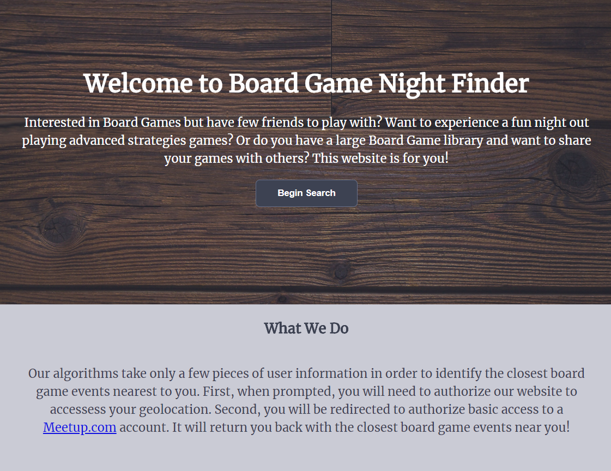
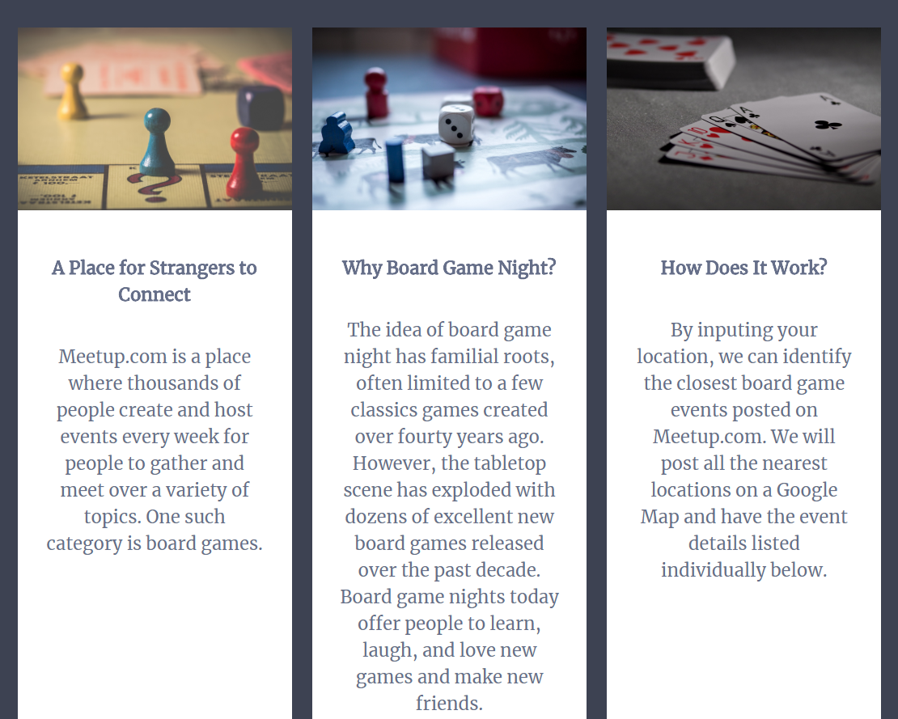
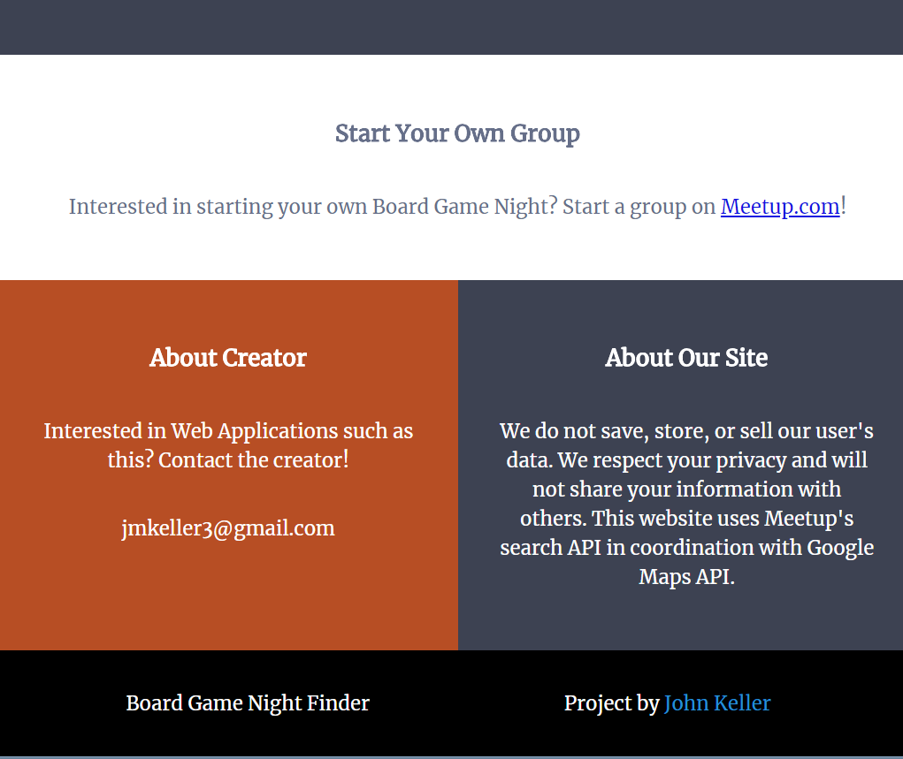
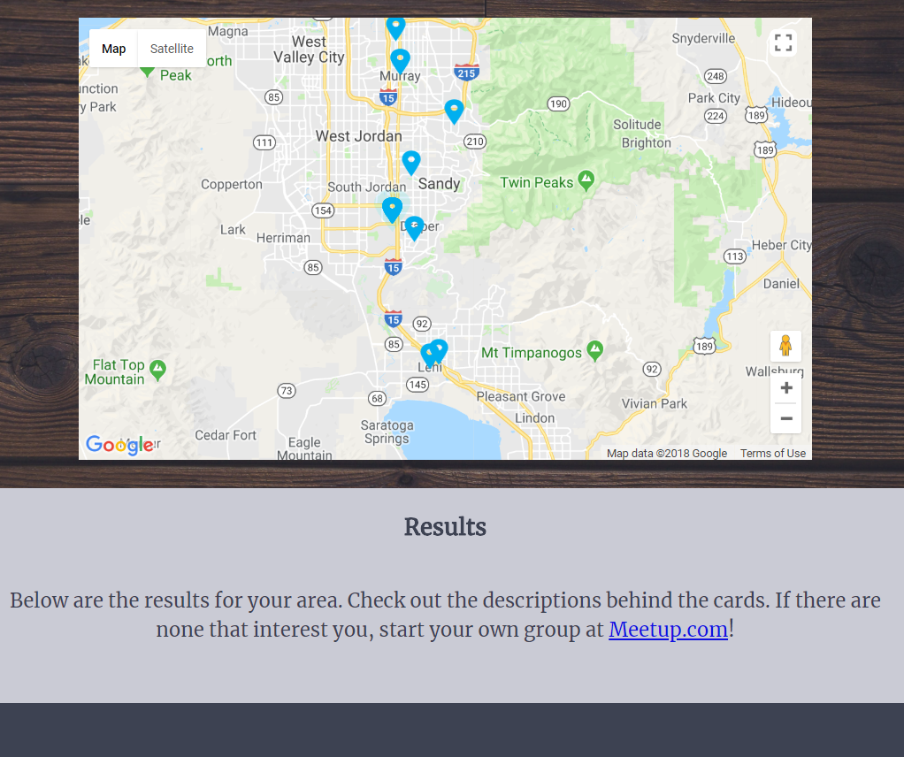
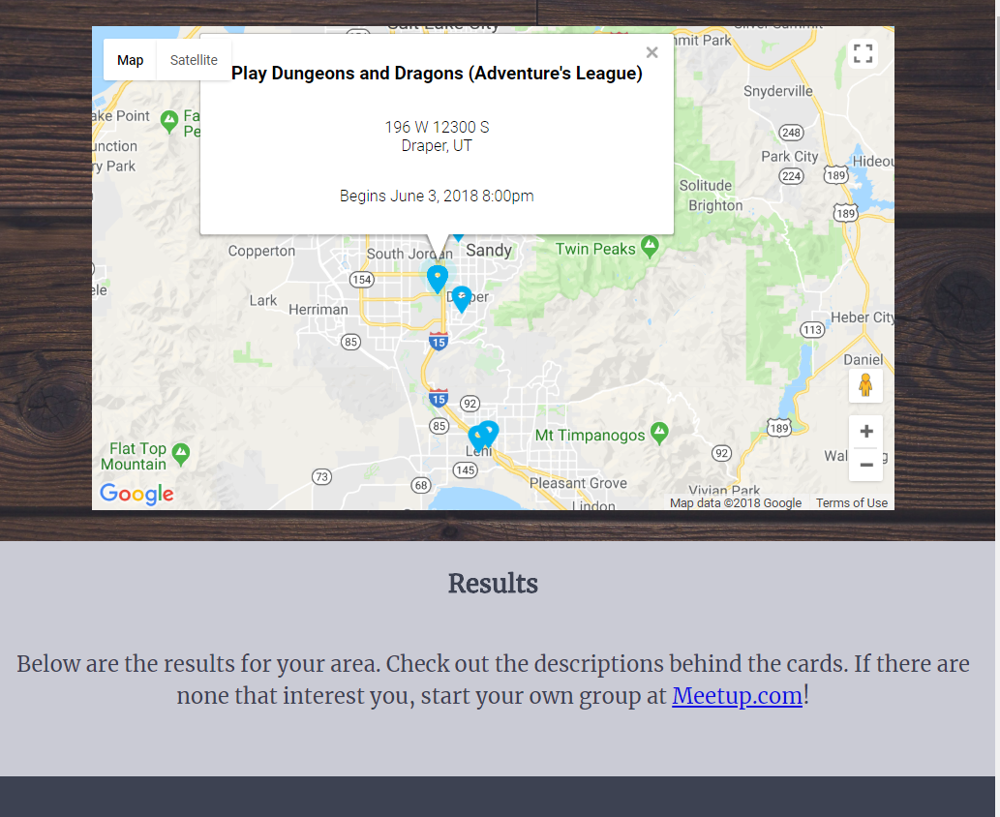
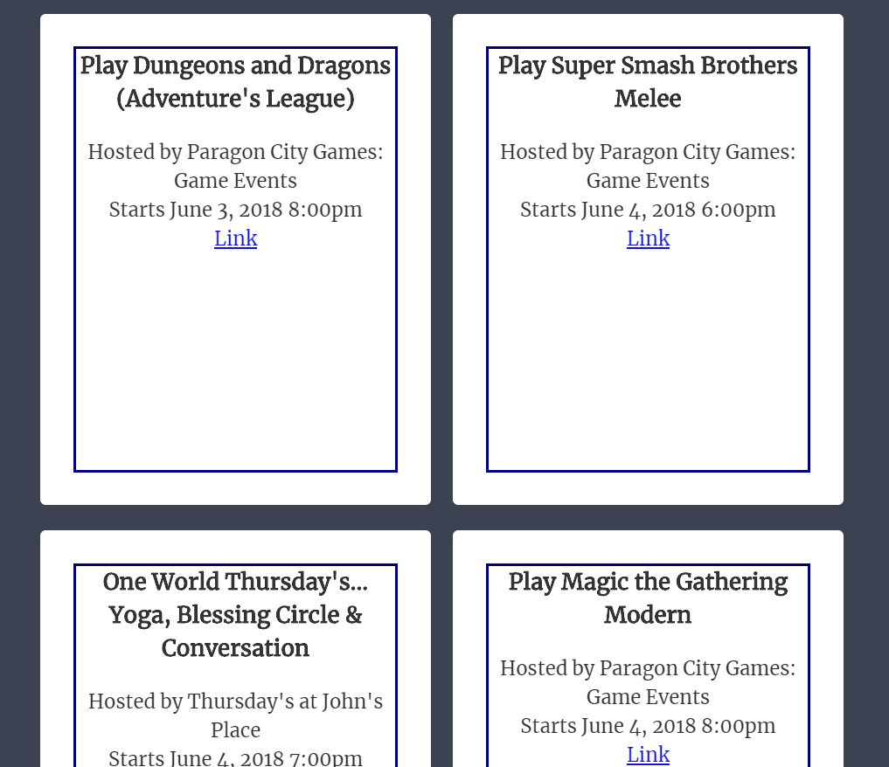
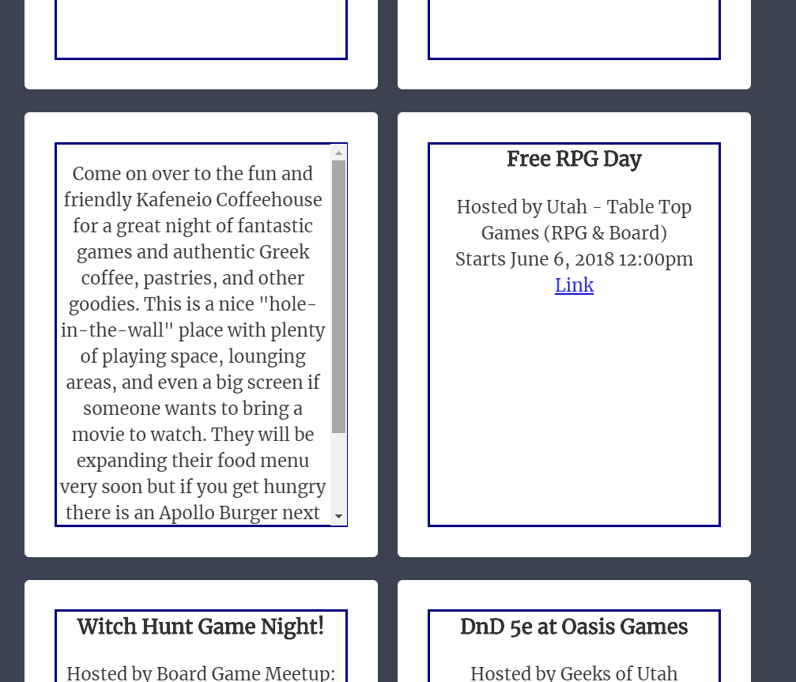

# BoardGameNight

A  geolocation search application for local board game events. 

## Motivation
I wanted a place where users can quickly find and locate board game nights in their area.

## Build Status

![Build Status]

## Screenshots 
Introduction Page:

Results Map:

Results Cards:

## Built With

* HTML
* CSS
* Javascript
* jQuery

## Demo

- [Live Demo](https://jmkeller3.github.io/BoardGameNight/)

## Author

* **John Keller** - ** Front-End development/Testing, Styling

## Acknowledgements

* **Nathaniel Webb** - ** - Advisor and Mentor

